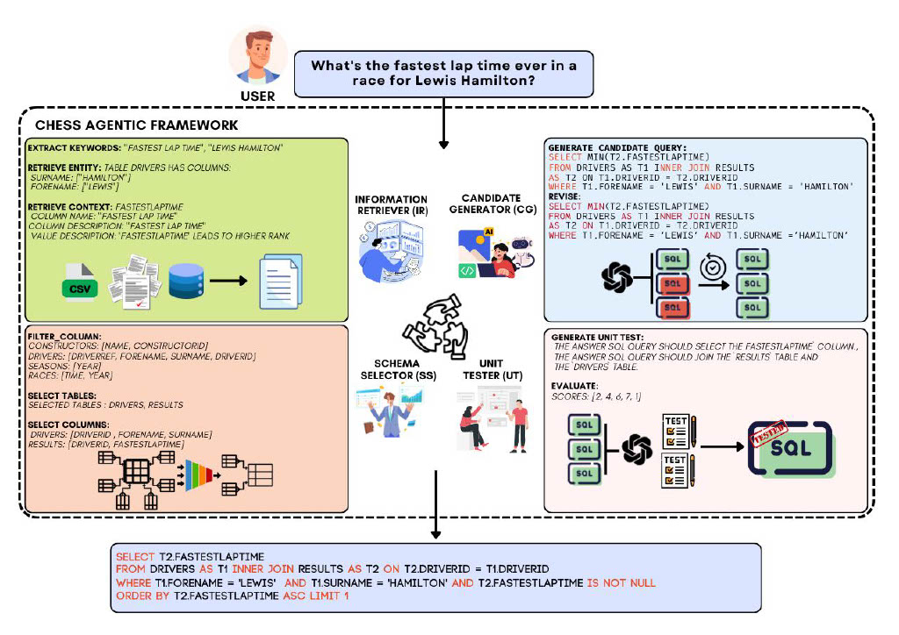

# CHESS: Contextual Harnessing for Efficient SQL Synthesis

This repository contains the code and data for the paper "CHESS: Contextual Harnessing for Efficient SQL Synthesis."

Translating natural language questions into SQL queries, known as text-to-SQL, is a long-standing research problem. Effective text-to-SQL synthesis can become very challenging due to:
- (i) The extensive size of database catalogs (descriptions of tables and their columns) and database values,
- (ii) Reasoning over large database schemas,
- (iii) Ensuring the functional validity of the generated queries,
- (iv) Navigating the ambiguities of natural language questions.

We introduce **CHESS**, a Large Language Model (LLM) based multi-agent framework for efficient and scalable SQL synthesis, comprising four specialized agents, each targeting one of the aforementioned challenges:

1. **Information Retriever (IR)**: Extracts relevant data.
2. **Schema Selector (SS)**: Prunes large schemas.
3. **Candidate Generator (CG)**: Generates high-quality candidates and refines queries iteratively.
4. **Unit Tester (UT)**: Validates queries through LLM-based natural language unit tests.

Our framework offers configurable features that adapt to various deployment constraints:

### Key Features

- **Industrial-Scale Database Support**: Using the Schema Selector agent, CHESS efficiently narrows down very large database schemas into manageable sub-schemas, boosting system accuracy by approximately 2% and reducing LLM token usage by 5x.
- **Privacy-Preserving Performance**: Among methods using open-source models, CHESS achieves state-of-the-art performance, providing a high-performing, privacy-preserving system suitable for industrial deployment.
- **Scalability**: In settings with high computational budgets, CHESS reaches 71.10% accuracy on the BIRD test set, within 2% of the leading proprietary method, while reducing LLM calls by approximately 83%.

## CHESS



## Setting up the Environment

1. **Clone the repository**:
    ```bash
    git clone https://github.com/yourusername/CHESS.git
    cd CHESS
    ```

2. **Create a `.env` file** in the root directory and add the following configuration:
    ```bash
    DATA_MODE="dev"
    DATA_PATH="./data/dev/dev.json"
    DB_ROOT_DIRECTORY="./data/dev/dev_databases"
    DATA_TABLES_PATH="./data/dev/dev_tables.json"
    INDEX_SERVER_HOST='localhost'
    INDEX_SERVER_PORT=12345

    OPENAI_API_KEY=
    GCP_PROJECT=''
    GCP_REGION='us-central1'
    GCP_CREDENTIALS=''
    GOOGLE_CLOUD_PROJECT=''
    ```

3. **Install required packages**:
    ```bash
    pip install -r requirements.txt
    ```

## Preprocessing

To retrieve database catalogs and find the most similar database values to a question, preprocess the databases:

1. **Run the preprocessing script**:
    ```bash
    sh run/run_preprocess.sh
    ```

    This will create the minhash, LSH, and vector databases for each of the databases in the specified directory.

## Running the Code

After preprocessing the databases, generate SQL queries for the BIRD dataset by choosing a configuration:

1. **Run the main script**:
    ```bash
    sh run/run_main_ir_cg_ut.sh
    ```

    or

    ```bash
    sh run/run_main_ir_ss_ch.sh
    ```

## Sub-sampled Development Set (SDS)

The sub-sampled development set (SDS) is a subset of the BIRD dataset with 10% of samples from each database. It is used for ablation studies and is available in `sub_sampled_bird_dev_set.json`.

## Supporting Other LLMs

To use your own LLM, modify the `get_llm_chain(engine, temperature, base_uri=None)` function and add your LLM in `run/langchain_utils.py`.

## Citation

If you find this repository helpful, please cite the following paper:

```bibtex
@article{talaei2024chess,
  title={CHESS: Contextual Harnessing for Efficient SQL Synthesis},
  author={Talaei, Shayan and Pourreza, Mohammadreza and Chang, Yu-Chen and Mirhoseini, Azalia and Saberi, Amin},
  journal={arXiv preprint arXiv:2405.16755},
  year={2024}
}
```