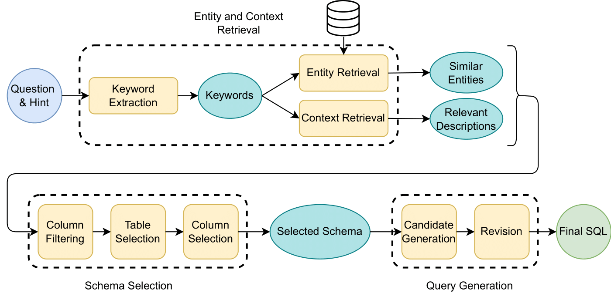

# CHESS: Contextual Harnessing for Efficient SQL Synthesis

This repository contains the code and data for the paper "CHESS: Contextual Harnessing for Efficient SQL Synthesis."

Utilizing large language models (LLMs) for transforming natural language questions into SQL queries (text-to-SQL) is a promising yet challenging approach, particularly when applied to real-world databases with complex and extensive schemas. In particular, effectively incorporating data catalogs and database values for SQL generation remains an obstacle, leading to suboptimal solutions. In CHESS, we address this problem by proposing a new pipeline that effectively retrieves relevant data and context, selects an efficient schema, and synthesizes correct and efficient SQL queries. To increase retrieval precision, our pipeline introduces a hierarchical retrieval method leveraging model-generated keywords, locality-sensitive hashing indexing, and vector databases. Additionally, we have developed an adaptive schema pruning technique that adjusts based on the complexity of the problem and the model’s context size. Our approach generalizes to both frontier proprietary models like GPT-4 and open-source models such as Llama-3-70B. Through a series of ablation studies, we demonstrate the effectiveness of each component of our pipeline and its impact on the end-to-end performance. Our method achieves new state-of-the-art performance on the cross-domain challenging BIRD dataset.

## CHESS



## Setting up the Environment

1. **Clone the repository**

2. **Create a `.env` file** in the root directory of the repository and add the following items to the file:
    ```
    OPENAI_API_KEY=<your_openai_api_key>
    DB_ROOT_PATH=<path_to_the_root_directory_of_the_repository> # e.g., "./data/dev"
    ```

3. **Install the required packages** using the following command:
    ```
    pip install -r requirements.txt
    ```

## Preprocessing

To effectively retrieve the database catalogs and find the most similar database values to a specific question, preprocess the databases by following these steps:

1. **Update the `run/run_preprocess.py` file** as follows:
    ```python
    db_root_directory="data/dev/dev_databases"  # UPDATE THIS WITH THE PATH TO THE DATABASES
    db_id="all"
    ```

2. **Run the preprocessing script**:
    ```
    sh run/run_preprocess.sh
    ```

    This will create the minhash, LSH, and vector databases for each of the databases in the specified directory.

## Running the Code

After preprocessing the databases, generate the SQL queries for the BIRD dataset by following these steps:

1. **Update the `run/run_main.sh` file** as follows:
    ```bash
    mode='test'  # Update this with the mode you want to run
    data_path="./data/dev/dev.json"  # UPDATE THIS WITH THE PATH TO THE TEST DATASET
    ```

2. **Deploy the finetuned model**:

   Follow the instructions below to deploy the finetuned model with an OpenAI-compatible API on a single A100 GPU server with PyTorch version 2.1 and CUDA 11.8.0:

   1. Install the required package:
       ```
       pip install vllm==0.3.3
       ```

   2. Update and install `tmux`:
       ```
       apt update
       apt install tmux
       ```

   3. Start a `tmux` session:
       ```
       tmux
       ```

   4. Run the model server:
       ```
       python -m vllm.entrypoints.openai.api_server --model AI4DS/NL2SQL_DeepSeek_33B --load-format safetensors --dtype bfloat16 --max-model-len 8192
       ```

   5. Update the server URI in the `run_main.sh` file for the "candidate_generation" node as follows:
       ```json
       "candidate_generation": {
           "engine": "'${engine6}'",
           "temperature": 0.0,
           "base_uri": "https://<server_URI>",  # Put the server URI here without /v1
           "sampling_count": 1
       }
       ```

3. **Run the main script**:
    ```
    sh run/run_main.sh
    ```

This structured guide will help you set up the environment, preprocess the data, and run the code for SQL synthesis efficiently.

# Sub-sampled Development Set (SDS)

The sub-sampled development set (SDS) is a subset of the BIRD dataset that contains 10% of samples from each database. The SDS is used to evaluate the performance of the method for ablation studies. The SDS is available in the `sub_sampled_bird_dev_set.json`.

# Support other LLMs

To serve your own LLM or any other LLM, you should modify the def get_llm_chain(engine, temperature, base_uri=None) function and add your own LLM in run/langchain_utils.py. This will allow you to serve your own LLM.


# Citation

If you find this repository helpful, please cite the following paper:

```
@article{talaei2024chess,
  title={CHESS: Contextual Harnessing for Efficient SQL Synthesis},
  author={Talaei, Shayan and Pourreza, Mohammadreza and Chang, Yu-Chen and Mirhoseini, Azalia and Saberi, Amin},
  journal={arXiv preprint arXiv:2405.16755},
  year={2024}
}
```
