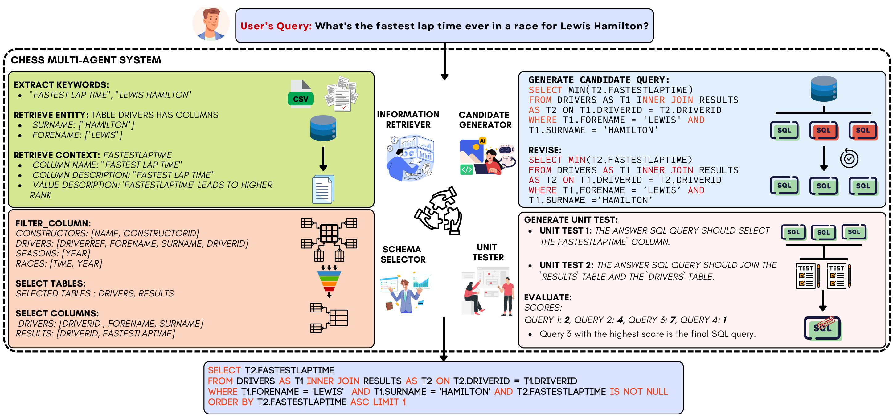

# CHESS: Contextual Harnessing for Efficient SQL Synthesis

This repository contains the code and data for the paper **"CHESS: Contextual Harnessing for Efficient SQL Synthesis"**.

Translating natural language questions into SQL queries, known as **Text-to-SQL**, remains challenging due to several factors:
- **Extensive database catalogs** (descriptions of tables and their columns) and database values,
- **Complexity of reasoning** over very large database schemas,
- Ensuring **functional correctness** of generated queries,
- Handling **ambiguities** inherent in natural language questions.

To address these challenges, we introduce **CHESS**, a flexible and modular multi-agent system comprising four specialized agents, each targeting a specific challenge:

1. **Information Retriever (IR)**: Efficiently retrieves relevant entities and context from large databases using a hierarchical retrieval mechanism.
2. **Schema Selector (SS)**: Effectively prunes very large schemas, significantly reducing computational load.
3. **Candidate Generator (CG)**: Generates and iteratively refines high-quality candidate SQL queries.
4. **Unit Tester (UT)**: Validates candidate queries using natural language unit tests generated by LLMs.

## Key Contributions

- **Novel Multi-Agent System for Text-to-SQL**:  
  We propose **CHESS**, a modular multi-agent system that significantly improves text-to-SQL performance and efficiency on complex, real-world databases. Its design allows flexible configuration to meet various deployment constraints.

- **Natural Language Unit Tests for SQL**:  
  We introduce natural language unit tests to effectively verify generated SQL queries during inference.

- **Schema Selector Agent for Industrial-Scale Schemas**:  
  We demonstrate performance degradation in recent long-context LLMs on industrial-scale database schemas exceeding 4,000 columns, and illustrate how our Schema Selector agent effectively manages these schemas, significantly boosting performance.

- **High Performance with Low Cost**:  
  Without any additional fine-tuning, **CHESS** achieves **71.10%** execution accuracy on the BIRD test set, within **2%** of the leading fine-tuned proprietary method, while requiring approximately **93% fewer** LLM calls and incurring **70% lower** computational cost (in USD).

## CHESS



## Setting up the Environment

1. **Clone the repository**:
    ```bash
    git clone https://github.com/yourusername/CHESS.git
    cd CHESS
    ```

2. **Create a `.env` file** in the root directory and add the following configuration:
    ```bash
    DATA_MODE="dev"
    DATA_PATH="./data/dev/dev.json"
    DB_ROOT_DIRECTORY="./data/dev/dev_databases"
    DATA_TABLES_PATH="./data/dev/dev_tables.json"
    INDEX_SERVER_HOST='localhost'
    INDEX_SERVER_PORT=12345

    OPENAI_API_KEY=
    GCP_PROJECT=''
    GCP_REGION='us-central1'
    GCP_CREDENTIALS=''
    GOOGLE_CLOUD_PROJECT=''
    ```

3. **Install required packages**:
    ```bash
    pip install -r requirements.txt
    ```

## Preprocessing

To retrieve database catalogs and find the most similar database values to a question, preprocess the databases:

1. **Run the preprocessing script**:
    ```bash
    sh run/run_preprocess.sh
    ```

    This will create the minhash, LSH, and vector databases for each of the databases in the specified directory.

## Running the Code

After preprocessing the databases, generate SQL queries for the BIRD dataset by choosing a configuration:

1. **Run the main script**:
    ```bash
    sh run/run_main_ir_cg_ut.sh
    ```

    or

    ```bash
    sh run/run_main_ir_ss_ch.sh
    ```

## Sub-sampled Development Set (SDS)

The sub-sampled development set (SDS) is a subset of the BIRD dataset with 10% of samples from each database. It is used for ablation studies and is available in `sub_sampled_bird_dev_set.json`.

## Supporting Other LLMs

To use your own LLM, modify the `get_llm_chain(engine, temperature, base_uri=None)` function and add your LLM in `run/langchain_utils.py`.
